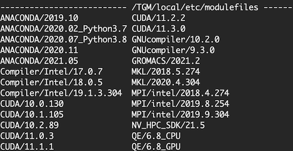
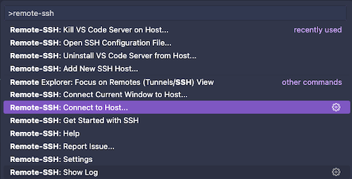
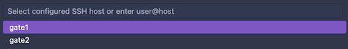
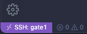

# 1 - Introduction to UBAI HPC Cluster

---

## 1.1 UBAI HPC Cluster

> [reference: Urban Big Data and AI Institute](https://ubai.uos.ac.kr/%EC%9D%B4%EC%9A%A9-%EC%95%88%EB%82%B4)

The **UBAI**(Urban Big Data and AI Institute) is **HPC**(High-Performance Computing) cluster, made by University of Seoul.

<details open>
  <summary>Specifications</h2></summary>

| **Partition** | **\#Nodes** | **\#Cores/node**  | **CPU** | **GPU/node** | **Memory/node** | Scratch | 
| --- | --- | --- | --- | --- | --- | --- |
| gpu1  | 14 | 48 | Intel Xeon Gold 6240R | **RTX3090(4EA)** | 768GB | 500GB |
| gpu6 | 5 | 48 | Intel Xeon Gold 6240R | **A10(4EA)** | 768GB | 500GB |
| cpu1 | 19 | 48 | Intel Xeon Gold 6240R | **-** | 768GB | 500GB |
| hgx | 1 | 48 | Intel Xeon Gold 6248R | **A100(8EA)** | 1536GB | 2TB |
| gpu2 | 10 | 56 | Intel Xeon Gold 6348R | **A10(8EA)** | 1024GB | 500GB |
| gpu3 | 11 | 56 | Intel Xeon Gold 6348R | **A10(4EA)** | 1024GB | 500GB |
| gpu4  | 29 | 56 | Intel Xeon Gold 6348R | **A6000(4EA)** | 1024GB | 500GB |
| gpu5  | 6 | 64 | Intel Xeon Platinum-8358 | **A6000(4EA)** | 1024GB | 500GB |

</details>

---

### 1.1.1 Partition QoS

All users are subject to the following limitations across all partitions:

<details open>
  <summary>QoS Details</h2></summary>

| **Partition** | **MaxJobs** | **MaxSubmit** | **MaxWall** |
| --- | --- | --- | --- |
| * | 10 | 20 | 2-00:00:00 |

</details>

---

### 1.1.2 RDMA Support

> `$ nvidia-smi topo -m`: you can check the RDMA capability of the NICs(Network Interface Card).

With *Infiniband*, GPUs can communicate between nodes without routing through the CPU. This technology, known as **RDMA**(Remote Direct Memory Access), enables direct GPU-to-GPU communication across nodes at a bandwidth of 200Gbps.

---

### 1.1.3 Environment Modules

UBAI supports the [**Environment Modules**](https://modules.readthedocs.io/en/latest/) package, allowing users to manage and modify their Linux environment. Users can check the available environments within UBAI by running the `$ module avail` command. (quit: press `q`)

```bash
$ module avail
```



The `$ module load {module}` command is used to load a specific environment. For example, to load the `ANACONDA/2019.10` environment, you can use the following command. (unload: `$ module unload {module}`)

```bash
$ module load ANACONDA/2019.10
```

---

## 1.2 Login to UBAI Cluster

> **Note**: The UBAI cluster is accessible only within the on-campus network of the University of Seoul(UOS).

(1) Place the key file (`{ubai-id}.pem`) containing the SSH access key received from the UBAI administrator into the `~/.ssh/`.

(2) Add the following configuration to the `~/.ssh/config` file.

```bash
Host gate1
    HostName {hpc-gate1-ip}
    Port 22
    User {ubai-id}
    IdentityFile {path-to-key-file}/{ubai-id}.pem

Host gate2
    HostName {hpc-gate2-ip}
    Port 22
    User {ubai-id}
    IdentityFile {path-to-key-file}/{ubai-id}.pem
```

(3) Connect to the UBAI cluster(`gate1` or `gate2`) using SSH.

```bash
$ ssh gate1
```

---

### 1.2.1 (Optional) Using VSCode Remote-SSH

> **Note**: You need to install the [Remote - SSH](https://code.visualstudio.com/docs/remote/ssh-tutorial) extension in VSCode.

(1) Open the command palette (`Ctrl + Shift + P`) and select `Remote-SSH: Connect to Host...`.



(2) Select `gate1` or `gate2` from the list.



(3) After connecting, you can open a terminal in VSCode and run commands on the UBAI cluster. When you connect to the UBAI cluster, you can see the `SSH: gate1` at the bottom left corner of the VSCode window.



---

## 1.3 File Transfer

You can use `scp` command to transfer files between your local machine and the UBAI cluster.

```bash
$ scp {path}/{file} {ubai-id}@{hpc-gate1-ip}:/home1/{ubai-id}/
```

---