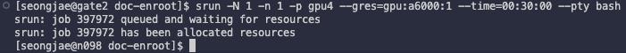
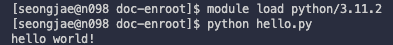
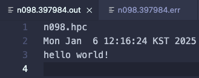
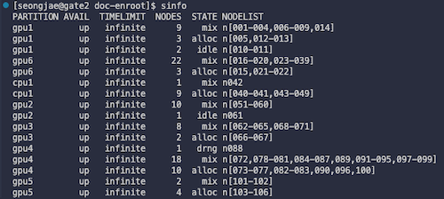
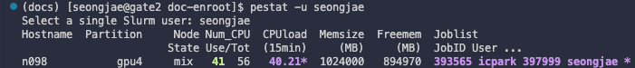

# 2 - Slurm Job Scheduler

> [SCHEDMD: Slurm Documentation](https://slurm.schedmd.com/documentation.html)

> [The Slurm tool "pestat"](https://github.com/OleHolmNielsen/Slurm_tools/tree/master/pestat)

---

## 2.1 Slurm Workload Manager

<h3 align="center">
  <p align="center">
  
  
  
  </p>
</h1>

**Slurm**(Simple Linux Utility for Resource Management) is an open-source job scheduler for Linux clusters. It is used to allocate resources, schedule jobs, and manage queues in HPC environments.

---

### 2.1.1 Slurm Commands

Following are some common Slurm commands:

**1. Job Submission/Cancellation**

| Command | Description |
| ------- | ----------- |
| `$ srun` | submit a job in real time. |
| `$ sbatch` | submit a job script for later execution. |
| `$ scancel {jobid}` | cancel a pending or running job. |

**2. Job Information**

| Command | Description |
| ------- | ----------- |
| `$ sinfo` | report the state of partitions and nodes managed by Slurm. |
| `$ squeue` | report the state of jobs or job steps. |
| `$ scontrol show job {jobid}` | show detailed information about a job. |

**3. Related Software**

| Command | Description |
| ------- | ----------- |
| `$ pestat` | report the nodes state with 1 line per node including job info. |

---

## 2.2 Submitting Jobs with Slurm

> [Slurm Documentation - srun command options](https://slurm.schedmd.com/srun.html#SECTION_OPTIONS)

---

### 2.2.1 Submitting an Interactive Job (srun)

> **Note**: To allocate GPU resources, you need to specify the `--gres` option in your job script.

For example, to request a compute node with 1 GPU (a6000) and run an interactive bash shell, use the following command:

```bash
# the `--pty` option is used to allocate a pseudo-terminal
$ srun --nodes=1 --ntasks-per-node=1 --partition=gpu4 --gres=gpu:a6000:1 --time=00:10:00 --pty bash

# The above command is equivalent to the following
$ srun -N 1 -n 1 -p gpu4 --gres=gpu:a6000:1 --time=00:30:00 --pty bash
```



(Example) If you want to run a Python script after requesting a compute node, you can use the following command:

```bash
$ module load python/3.11.2   # load the python module

$ python hello.py             # run the python script
```



You can immediately cancel the job by pressing `Ctrl+D` in the terminal.

---

### 2.2.2 Submitting a Job Script (sbatch)

You can submit a job script using the `sbatch` command. For example, create a script named `run_hello.sh` with the following content:

```bash
#!/bin/bash
#SBATCH --nodes=1             # request 1 node
#SBATCH --ntasks-per-node=1   # 1 task per node
#SBATCH --partition=gpu4      # partition name
#SBATCH --gres=gpu:a6000:1    # request 1 GPU
#SBATCH -o ./%N.%j.out        # STDOUT(log file)
#SBATCH -e ./%N.%j.err        # STDERR(log file)
#SBATCH --time=00:30:00       # time limit (hh:mm:ss)

hostname                      # print the name of the node
date                          # print the date

module add python/3.11.2      # load the python module

python hello.py               # run the python script
```

To submit the job script, use the following command:

```bash
$ sbatch run_hello.sh
```

If the job is successfully submitted, a output/error file will be created with the name `{hostname}.{jobid}.out` and `{hostname}.{jobid}.err`. 

| Field | Description |
| ----- | ----------- |
| `hostname` | the name of the node where the job is running |
| `jobid` | the ID assigned to the job by Slurm |



---

### 2.2.3 Cancelling Jobs

> [Slurm Documentation - scancel](https://slurm.schedmd.com/scancel.html)

To cancel a job, use the `scancel` command followed by the job ID. For example, to cancel a job with ID `12345`, use the following command:

```bash
$ scancel 12345
```

---

## 2.3 Checking Job Status

---

### 2.3.1 Checking Node Status (sinfo)

> [Slurm Documentation - sinfo](https://slurm.schedmd.com/sinfo.html)

This command will display the status of all nodes in the cluster, including their availability and partition information.

```bash
$ sinfo
```



Node state code can be one of the following:

| STATE | Description |
| ----- | ----------- |
| `alloc` | the node is allocated to one or more jobs. |
| `drain` | the node is unavailable for use. (per system administrator request) |
| `mix` | the node has some of its CPUs allocated while others are idle. |
| `drng` | the node is currently allocated but is being drained. |
| `idle` | the node is available for jobs. |
| `down` | the node is unavailable for use. (some failure occurred) |

---

### 2.3.2 Checking Job Status (squeue)

> [Slurm Documentation - squeue](https://slurm.schedmd.com/squeue.html)

This command will display the status of all jobs in the queue, including their job ID, partition, and state.

```bash
$ squeue
```


Job state code can be one of the following:

| STATE | Description |
| ----- | ----------- |
| `R` `RUNNING` | the job currently has an allocation.
| `PD` `PENDING` | the job is awaiting resource allocation. |
| `F` `FAILED` | the job terminated with non-zero exit code or other failure. |
| `ST` `STOPPED` | the job has been stopped. |

---

### 2.3.3 Checking Job Details (scontrol)

> [Slurm Documentation - scontrol](https://slurm.schedmd.com/scontrol.html)

This command will display detailed information about a specific job, including its status, resource allocation, and other parameters.

```bash
$ scontrol show job {jobid}
```

---

### 2.3.4 Checking User Nodes (pestat -u)

> **Note**: The `pestat` command is not part of the standard Slurm distribution. It is a third-party tool that provides additional functionality for checking node status.

This command will print nodes status with 1 line per node including job info.

```bash
# check the status of user nodes
$ pestat -u {username}
```



---