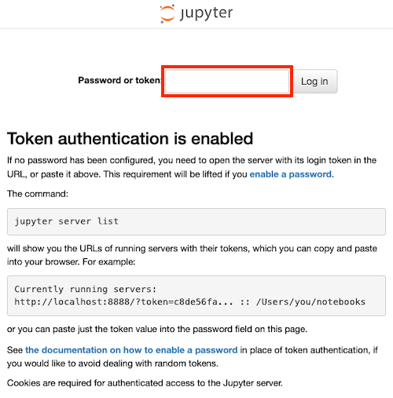

# 3 Using Jupyter Lab on Slurm

---

## 3.1 Installing Miniconda

If `$ module avail` does not show the `conda` module, you can use the following command to install Miniconda: (just `yes` to all prompts)

```bash
# download the Miniconda installer
$ wget https://repo.anaconda.com/miniconda/Miniconda3-latest-Linux-x86_64.sh

# install Miniconda
$ bash Miniconda3-latest-Linux-x86_64.sh
```


After the installation, Miniconda will be installed in the `~/miniconda3` directory by default.

---

### 3.1.1 Add Environment Variables (.bashrc)

Then, you need to add the following lines to your `~/.bashrc` file to initialize Conda. (You can use `nano ~/.bashrc` or `vim ~/.bashrc` to edit the file.)

> **Notes:** you need to change the `{path-to-miniconda}` to your Miniconda installation path.

```bash
# ~/.bashrc
# ...

# >>> conda initialize >>>
# !! Contents within this block are managed by 'conda init' !!
__conda_setup="$('{path-to-miniconda}/miniconda3/bin/conda' 'shell.bash' 'hook' 2> /dev/null)"
if [ $? -eq 0 ]; then
    eval "$__conda_setup"
else
    if [ -f "{path-to-miniconda}/miniconda3/etc/profile.d/conda.sh" ]; then
        . "{path-to-miniconda}/miniconda3/etc/profile.d/conda.sh"
    else
        export PATH="{path-to-miniconda}/miniconda3/bin:$PATH"
    fi
fi
unset __conda_setup
# <<< conda initialize <<<
```

After adding the above lines, restart your terminal.

---

## 3.2 Using Jupyter Lab with Conda

Follow the steps below to set up a Jupyter Lab environment using Conda:

```bash
$ conda create -n <env_name> python=3.9
$ conda activate <env_name>
```

install the required packages:

```bash
$ conda install ipykernel jupyterlab
```

---

### 3.2.1 Job Submission

Next, you need to create a job script to run Jupyter Lab. You can use the following example job script: (`run_jupyter.sh`)

> **Note:** You need to change the `gate_node` to your HPC gate node.

```bash
#!/bin/bash
#SBATCH --nodes=1
#SBATCH --ntasks-per-node=1
#SBATCH --partition=gpu4
#SBATCH --gres=gpu:a6000:1
#SBATCH -o ./%N.%j.out
#SBATCH -e ./%N.%j.err
#SBATCH --time=00:30:00

gate_node='gate2'

user=`whoami`
gate_port=`python -c 'import socket; s = socket.socket(); s.bind(("", 0)); print(s.getsockname()[1]); s.close();'`
ssh -T $user@$gate_node
node_port=`python -c 'import socket; s = socket.socket(); s.bind(("", 0)); print(s.getsockname()[1]); s.close();'`
ssh -T $user@$gate_node -R $gate_port:localhost:$node_port -fN "while sleep 100; do; done"&

# print job info
echo "start at:" `date`
echo "node_port: $node_port"
echo "gate_port: $gate_port"

python -m jupyter lab $HOME \
        --ip=0.0.0.0 --port $node_port --allow-root --no-browser
```

Then, submit the job script to Slurm:

```bash
sbatch run_jupyter.sh
```

---

### 3.2.2 Port Forwarding Using VSCode (Recommand)

> [Visual Studio Code: How to use port forwarding](https://code.visualstudio.com/docs/debugtest/port-forwarding#_how-to-use-port-forwarding)

To port forward the Jupyter Lab, check the STDOUT file(`jupyter.%N.%j.out`) for the port number(`gate_port`).


Then, need to set up port forwarding in VSCode. First, navigate to the `PORTS` tab in the bottom panel of VSCode, and select the `Forward a Port` option.


Enter the port number to forward (e.g., `39835`).


Then, select the `Open in Browser` button.


You will access the Jupyter Lab in your browser. (e.g., `http://localhost:39385`)

---

### 3.2.3 Authentication

After the port-forwarding, copy the token from the STDERR file(`jupyter.%N.%j.err`).

```bash
# jupyter.%N.%j.err
Or copy and paste this URL:
    http://127.0.0.1:{node_port}/lab?token=01ab123cdef4567d8910efghi012345jklmno432p12345qr
```

Then, paste the token in your browser to access the Jupyter Lab.



---

## 3.3 (Optional) Using a Specific CUDA Version

> **Note:** The UBAI's default CUDA version on the node is `11.2.2`. If you want to use a different version, you need to load the desired version of CUDA in your job script. (Be careful with the [CUDA compatibility for GPU microarchitecture](https://en.wikipedia.org/wiki/CUDA#GPUs_supported))

If you need to use CUDA, you must check the CUDA versions on the node. For example, if you want to use CUDA 11.8.0, you can add the following lines to your job script:

```bash
# run_jupyter.sh (line 11-12)
# module avail cuda          # (optional) check the available CUDA versions
module unload cuda/11.2.2    # default version 
module load cuda/11.8.0      # load the desired version
```

---