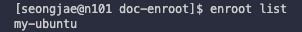
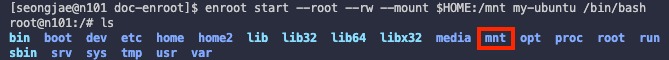
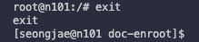

# 4 Using Docker Container with Enroot

> [NVIDIA: Enroot Documentation](https://github.com/NVIDIA/enroot/tree/master/doc)

---

## 4.1 NVIDIA Enroot

**Enroot** is a rootless container runtime optimized for running GPU-accelerated applications designed by NVIDIA.

---

## 4.2 Enroot Commands

> [Enroot Documentation - Commands](https://github.com/NVIDIA/enroot/blob/master/doc/usage.md)

Following are the basic commands for Enroot. (`enroot COMMAND [ARG...]`)

| Command | Description |
| ------- | ----------- |
| `import` | Import a container image from a specified source. |
| `create` | Create a container root filesystem from a image. |
| `start`  | Start a container and invoke the command script. |
| `export` | Create a container image from the running container. |

---

## 4.3 (Example) Importing Docker Container

The Enroot commands is not scheduled by Slurm, and you must directly access the node using `srun` to run the Enroot commands.

```bash
# Access the node(on gpu5 partition) using srun
$ srun -N 1 -n 1 -p gpu5 -c 2 --pty bash
```

---

### 4.3.1 Importing Ubuntu 20.04 Image

> [Docker Hub](https://hub.docker.com/)

If you download the container image from Docker Hub, `docker://` prefix must be used. The image will be imported as a [squashfs](https://www.kernel.org/doc/Documentation/filesystems/squashfs.txt) image file with the `.sqsh` extension.

```bash
# ubuntu+20.04.sqsh will be created
$ enroot import docker://ubuntu:20.04
```

---

### 4.3.2 Creating Rootless Container

> [Enroot Documentation - create](https://github.com/NVIDIA/enroot/blob/master/doc/cmd/create.md)

After importing the container image, you can create a container root filesystem using the following command:

```bash
# container name: my-ubuntu
$ enroot create --name my-ubuntu ubuntu+20.04.sqsh
```

You can check the created container using the `$ enroot list` command:



---

### 4.3.3 Running Container with Enroot

> [Enroot Documentation - start](https://github.com/NVIDIA/enroot/blob/master/doc/cmd/start.md)

To run the container, you can use the following command: (It will mount the `$HOME` directory to `/mnt` in the container.)

```bash
$ enroot start --root --rw --mount $HOME:/mnt my-ubuntu /bin/bash
```

| Option | Description |
| ------ | ----------- |
| `--root` | Allow root access to the container. |
| `--rw` | Allow read/write access to the container. |
| `--mount` | Mount the specified directory to the container.<br>(e.g., `$HOME:/mnt`: `$HOME` is mounted to `/mnt`) |

When you enter the container, you can see the mounted directory(`/mnt`) in the container filesystem. 



To exit the container, you can use the `exit` command.



---

### 4.3.4 Exporting Container

> [Enroot Documentation - export](https://github.com/NVIDIA/enroot/blob/master/doc/cmd/export.md)

After working inside the created container, you must repack it into an image. Otherwise, the changes made inside the container will be lost.

```bash
$ enroot export -o ~/my-ubuntu-20250106.sqsh my-ubuntu
```

---