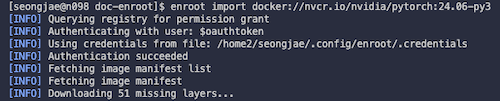

# 5 PyTorch Training with NGC Container

> [NGC(NVIDIA GPU Cloud) Catalog](https://catalog.ngc.nvidia.com/containers)

---

## 5.1 Environment Setup

First, access the node using `srun` command to run the Enroot commands. The example command will access the node on the `gpu4` partition with 1 GPU(A6000) and 8 CPU cores.

```bash
# Access the node(on gpu4 partition) using srun
$ srun -N 1 -n 1 -p gpu4 -c 8 --gres=gpu:a6000:1 --time=02:00:00 --pty bash

# Check the GPU information
$ nvidia-smi
```

---

### 5.1.1 NGC Authentication

> **Note**: You must get the authentication token from NGC website to pull the container image.

You can get your NGC token from the [NGC website](https://ngc.nvidia.com/setup/api-key).


Then, create a `~/.config/enroot/` directory(same as `$ENROOT_CONFIG_PATH`) and write a `.confidentials` file in it.

```bash
# ~/.config/enroot/.confidentials 
# replace {your-ngc-token} with your NGC token
machine nvcr.io login $oauthtoken password {your-ngc-token}
machine authn.nvidia.com login $oauthtoken password {your-ngc-token}
```

---

### 5.1.2 Importing NGC Container Image

For example, to import the [pytorch:24.06-py3 image](https://docs.nvidia.com/deeplearning/frameworks/pytorch-release-notes/rel-24-06.html), use the following command:

```bash
# nvidia+pytorch+24.06-py3.sqsh will be created
$ enroot import docker://nvcr.io/nvidia/pytorch:24.06-py3
```



After importing the container image, you can create a container root filesystem using the following command:

```bash
$ enroot create --name my-torch nvidia+pytorch+24.06-py3.sqsh

# Check the created container
$ enroot list
```

---

## 5.2 (Example) PyTorch Model Training

> [PyTorch Examples - MNIST](https://github.com/pytorch/examples/blob/main/mnist/main.py)

For example, to train a simple PyTorch CNN model using the MNIST dataset, you can use the following command:

```bash
$ enroot start --root --rw \
    --mount $HOME:/workspace/mnt my-torch \
    /bin/bash -c "cd /workspace/mnt && python3 mnist.py"
```

---