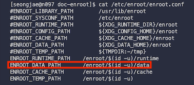
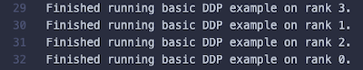

# 6 PyTorch Distributed Training on Slurm

---

## 6.1 torch.distributed.init_process_group

> [PyTorch: Getting Started with Distributed Data Parallel](https://pytorch.org/docs/stable/distributed.html)

To run a PyTorch model in parallel across multiple GPUs, we can use the `torch.distributed` package. Let's see how to set up a distributed PyTorch application.

```python
# ...
import os
import torch

# 1. get the world size and rank from environment variables
world_size = int(os.getenv('WORLD_SIZE', '1'))
rank = int(os.getenv('RANK', '0'))

# 2. define the init method
init_method = 'tcp://'
master_ip   = os.getenv('MASTER_ADDR', 'localhost')    # os.getenv(key, default)
master_port = os.getenv('MASTER_PORT', '8000')
init_method += master_ip + ':' + master_port

# 3. initialize the process group
torch.distributed.init_process_group(
    backend="nccl",
    world_size=world_size,
    rank=rank,
    init_method=init_method,
)
```

| Parameter | Description |
|-----------|-------------|
| `backend` | Backend to use for distributed communication.<br>(e.g., `nccl`, `gloo`, `mpi`) |
| `world_size` | Number of processes participating in the job. |
| `rank` |  Rank of the current process. |
| `init_method` | URL specifying how to initialize the process group. |

To run a distributed PyTorch application on Slurm, you need to set the `WORLD_SIZE`, `NODE_RANK`, and `MASTER_ADDR` environment variables.

---

## 6.2 Initialization on Slurm

To set up a distributed PyTorch application on Slurm, we need to set up the following scripts.

```
# (1) run_script.sh -> (2) torchrun.sh -> (3) train.py
├── env.sh                       # Environment variables
├── run_script.sh                # Slurm job script
├── torchrun.sh                  # torchrun script
└── train.py                     # PyTorch model training code
```

---

### 6.2.1 Set Environment Variables (env.sh)

You can calculate the `world_size`, `rank`, and `local_rank` as follows:

> `N`: \#nodes, `M`: \#GPUs per node

| Parameter | Calculation |
|-----------|-------------|
| `world_size` | `N` * `M` |
| `rank` | From 0 to `world_size` - 1 |
| `local_rank` | From 0 to `M` - 1 |

All the environment variables are set in `env.sh` file.

```bash
NNODES=<total number of nodes>
NPROC_PER_NODE=<number of GPUs per node>
WORLD_SIZE=$((NPROC_PER_NODE * NNODES))
```

---

### 6.2.2 Slurm Job Script (run_script.sh)

> [Slurm Documentation - sbatch](https://slurm.schedmd.com/sbatch.html)

Using the Slurm environment variables, we can set the `MASTER_ADDR` in job script. 

```bash
function get_master_address(){
    NODE_LIST=`scontrol show hostnames $SLURM_JOB_NODELIST`
    MASTER_HOST=`echo $NODE_LIST | awk '{print $1}'`
    MASTER_ADDR=`cat /etc/hosts | grep $MASTER_HOST | awk '{print $1}'`
}

get_master_address
echo MASTER_ADDR:$MASTER_ADDR
```

To set the `NODE_RANK`, get the list of nodes allocated to the job, then find the local rank based on the hostname of the current node.

```bash
NODE_LIST=`scontrol show hostnames $SLURM_JOB_NODELIST`
node_array=($NODE_LIST)
length=${#node_array[@]}
hostnode=`hostname -s`

for (( index = 0; index < length ; index++ )); do
    node=${node_array[$index]}
    if [ $node == $hostnode ]; then
        NODE_RANK=$index
    fi
done 
```

---

### 6.2.3 Check Enroot Runtime Configuration

To check the container existence, You need to check the Enroot runtime configuration on the `enroot.conf` file. (under `/etc/enroot/`)

```bash
$ cat /etc/enroot/enroot.conf
```



According to the configuration, the container will be created in the `/enroot/{uid}/data/{container_name}` directory.

```bash
# env.sh
CONTAINER_IMAGE="$HOME/nvidia+pytorch+24.06-py3.sqsh"
MY_UID=`id -u`
CONTAINER_NAME="my-torch"
CONTAINER_CACHE_DIR="/enroot/$MY_UID/data/$CONTAINER_NAME"

# run_script.sh
if [ -d "$CONTAINER_CACHE_DIR" ] ; then 
    echo "container exist";
else
    enroot create -n $CONTAINER_NAME $CONTAINER_IMAGE ;
fi

# ...

enroot start --root --rw \
            --mount $HOME:/workspace/mnt \
            $CONTAINER_NAME \
            bash -c "torchrun.sh \$NODE_RANK $MASTER_ADDR"
```

---

### 6.2.4 torchrun Script (torchrun.sh)

> **Note**: `--standalone` is used for single-node multi-GPU training.

When job is submitted, the `torchrun.sh` script will be executed. The script will set the environment variables and run the `train.py` script.

```bash
torchrun --standalone \
         --nnodes $NNODES \
         --nproc_per_node $NPROC_PER_NODE \
         --node_rank $NODE_RANK \
         --master_addr $MASTER_ADDR \
         --master_port $MASTER_PORT \
         train.py -np $NPROC_PER_NODE \
                  -n $NNODES
```

---

### 6.2.5 Slurm Job Submission

> **Note**: The job script is submitted using the `sbatch` command.

```bash
$ sbatch run_script.sh
```

If the job is successfully submitted, you will get the following output: (`./log/$SLURM_JOB_ID/{hostname}.out`)



---