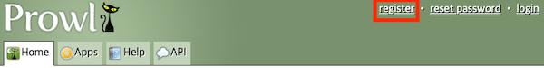

# Sending Push Notifications When Job Starts

> [Prowl](https://www.prowlapp.com/)

---

## ⏰ Job Script with Push Notification

When the cluster is busy, the job may be delayed. To know when the job starts, you can use a push notification service. 

This script sends a push notification to your iOS device when the job starts using the Prowl app.

---

## 1. Register for Prowl

First, you need to register for Prowl and get your API key. Follow these steps:

1: Go to the [Prowl website](https://www.prowlapp.com/) and create an account.



2: After registering, go to the "API Keys" section and create a new API key.


---

## 2. Set Up the Job Script

1: Copy the API key and paste it into the job script below. (`~/prowl.sh`)

```bash
# ~/prowl.sh
apikey=<your_prowl_api_key>
current_time=`date +%Y%m%d-%H%M%S`
```

2: Insert the job script below into your slurm job script.

```bash
# job_script.sh
. $HOME/prowl.sh

curl -X POST --data "apikey=$apikey" --data "priority=high" --data "event=slurm job $SLURM_JOB_ID established. $current_time" --data "application=UBAInotification" https://api.prowlapp.com/publicapi/add
```

---

## 3. Submit the Job

Submit the job script using the `sbatch` command.

```bash
$ sbatch job_script.sh
```

If the job is delayed, you will receive a push notification on your iOS device when the job starts.


---